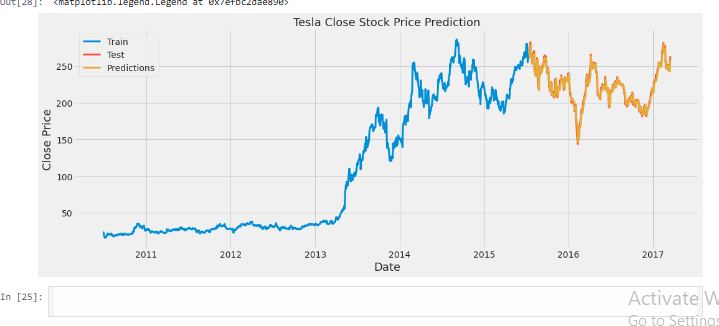

# 🚗 **Tesla Stock Forecasting**  

## 📌 Project Overview  
This project involves the development of a **predictive model** to forecast Tesla (TSLA) stock prices using historical data. By applying **time series analysis** and **machine learning techniques**, the model predicts future stock trends, providing valuable insights for informed investment decisions.  

---

## 🚀 **Features**  
- **Data Preprocessing**: Cleaned and transformed raw stock price data to make it suitable for modeling.  
- **Time Series Analysis**: Applied statistical methods to analyze historical stock price trends and predict future movements.  
- **Machine Learning**: Built and trained predictive models using algorithms like **Linear Regression** and **Random Forests**.  
- **Model Evaluation**: Assessed model performance using key metrics like **MSE (Mean Squared Error)**, **RMSE (Root Mean Squared Error)**, and **R-squared** to ensure accuracy.  
- **Visualization**: Used **Matplotlib** and **Seaborn** for visualizing trends, forecasted values, and error analysis.  

---

## 📷 Dashboard Preview

## 🛠️ **Technologies Used**  
- **Python** – Programming language for data analysis and model building.  
- **Pandas** – Data manipulation and preprocessing.  
- **NumPy** – Handling numerical data and array operations.  
- **Matplotlib** & **Seaborn** – Data visualization libraries for plotting graphs and trends.  
- **Scikit-Learn** – Machine learning library for building and evaluating models.  
- **Time Series Analysis** – Statistical methods like ARIMA and Exponential Smoothing for trend analysis.  

---

## 📁 **Project Structure**  
